<picture>
  <source media="(prefers-color-scheme: dark)" srcset="assets/header-dark.svg">
  <source media="(prefers-color-scheme: light)" srcset="assets/header-light.svg">
  
</picture>

I write tests, and I write the machinery that decides whether anything is allowed to ship. Lately most of that machinery is pointed at AI-assisted development: agent harnesses, verification gates, and the infrastructure that keeps a generated diff reviewable.

## Day job

**QA Automation Engineer, Java.** UI and API automation: Selenide, REST Assured, JUnit 5, TestNG, wired into pipelines so a red run blocks a merge instead of decorating a dashboard. Parallel browser grids, flake quarantine, and Allure reporting that survives contact with a real release train. This is the paid, professional half and it is where the test-engineering discipline comes from.

## Independent work

Everything below is built on my own time, outside working hours. It is where the AI infrastructure and product engineering happen.

**Harness and infrastructure for AI engineering.** Agent skills, hooks and subagent pipelines around LLM-assisted development. Cost and observability harnesses, verification gates, reversible-change workflows. The goal is a loop that stays measurable: every generated change lands small, behind a gate, with a way back. Same tools and same person before and after, so the only variable is the harness rather than the adoption of AI, and the throughput difference is about an order of magnitude per month. [How it is built, with current figures](engineering/agent-harness.md).

**Product engineering.** A real-time 3D web client on Babylon.js and WebGPU with a clustered lighting pipeline and procedural map generation, on a Kotlin and Spring Boot server-authoritative backend. Held to the same CI discipline as the day-job test code, because that is the half I already know how to do properly.

## Stack

**Languages**

**Test automation**

**Agent tooling**

**Infrastructure and data**

## Writing

| | |
| --- | --- |
| [**Running an agent harness at 2 500+ commits a day**](engineering/agent-harness.md) | Why the bottleneck in AI-assisted engineering is disproving a change, not generating one. Gate design, domain oracles, adversarial review, and the before-and-after numbers with the caveats attached. |
| [**Field notes**](engineering/field-notes.md) | Five debugging results: an 8.1 MB payload caused by a shared module in the wrong chunk, clustered lighting that was never once enabled, a golden frame pinned but not reproducible, a CI probe measuring the wrong endpoint, and a scatter kernel that could not be tuned because it was structurally incapable. |

## Selected work

| Repo | What it is | Stack |
| --- | --- | --- |
| [**jqe_ui_api**](https://github.com/zen2281488/jqe_ui_api) | UI and API automation suite: booking-service API cases, bank-app UI cases, with a [published Allure report](https://zen2281488.github.io/jqe_ui_api/) | Java, Selenide, REST Assured, JUnit 5, Allure |
| [**AniViewJet**](https://github.com/zen2281488/AniViewJetRelease) | Android TV client shipped as signed APK releases, with its own source resolvers and release channel | Kotlin, Jetpack Compose, Android TV |
| [**WinnerOfDay**](https://github.com/zen2281488/WinnerOfDay) | VK community bot: picks a daily winner from chat history, keeps a leaderboard, answers through a swappable LLM backend | Python 3.11, Docker Compose, VK API, Groq / Venice |
| [**Silicium_3_0**](https://github.com/zen2281488/Silicium_3_0) and [**SiliciumSDETapiCase**](https://github.com/zen2281488/SiliciumSDETapiCase) | SDET practicum work and test assignments: REST API and UI suites | Java, JUnit, REST Assured |

More automation samples live in [**qaa_projects**](https://github.com/zen2281488/qaa_projects).

## Signal

<picture>
  <source media="(prefers-color-scheme: dark)" srcset="assets/signal-dark.svg">
  <source media="(prefers-color-scheme: light)" srcset="assets/signal-light.svg">
  
</picture>

<!-- stats:start -->
**Most of it is private, and most of it is after hours.** Roughly 30 of my 44 repositories are private, and that is where the harness, the 3D client and the tooling around them live. What is public here is test automation and side projects.

Card regenerated 2026-08-29 by [scripts/refresh-stats.mjs](scripts/refresh-stats.mjs).
<!-- stats:end -->

The volume is a working style, not a metric game. Changes land in small increments behind verification gates rather than as large unreviewed drops, which is what makes the rate survivable. Gate design and the caveats are in [agent-harness.md](engineering/agent-harness.md).

## Contact

Telegram: [@zen_Warrior](https://t.me/zen_Warrior)
