# Running an agent harness at 2 500+ commits a day

In August 2026 this account started producing an order of magnitude more contributions per month than it had all year. The busiest single day cleared 4 000. Figures are at the end, and the public contribution calendar backs them up.

The first reasonable reaction to numbers like that is that something is generating noise. This is a description of what actually sits behind them, and why the volume is a side effect rather than the goal.

The comparison worth making is not before and after adopting AI. Both sides of that jump are AI-assisted: the earlier months were plain Claude Code and GPT sessions, driven by hand, one conversation at a time. Same tools, same person, same codebase. What changed in August is that the loop around the model became machinery instead of a chat window.

One thing to state plainly up front: this is independent work. My paid job is QA automation in Java, and the harness described here was built outside it, on my own projects and my own time. The test-engineering instincts come from the day job. The harness is what happened when I pointed those instincts at generated code instead of human code.

## The problem the harness solves

Most teams already have the models. Everyone has a coding agent, and the productivity curve still looks flat. That is the interesting problem, and it is not a model-quality problem.

An LLM will write a plausible diff for almost anything you ask. The diff compiles often enough to feel productive and is wrong often enough to be dangerous. The expensive part of AI-assisted engineering is not generation. It is knowing which generated change is allowed to survive.

So the throughput ceiling is not how fast a model writes code. It is how fast you can **disprove** a change. Driving an agent by hand, you are the verifier: you read every diff, you decide, and the loop stalls whenever you are reading. That ceiling sits somewhere around a few hundred reviewed changes a month, which is exactly where the first seven months landed.

The harness exists to move verification off the human and into machinery that runs unattended. The human moves up a level, to intent and acceptance criteria.

## The closed control loop

A prompt chain is open-loop: it produces code and stops. This harness continues until the change either survives independent evidence or is rejected. Every stage emits an inspectable artifact for the next stage: a research claim with provenance, an acceptance condition, a bounded diff, a test result, a review finding or an exact-revision runtime artifact.

<picture>
  <source media="(prefers-color-scheme: dark)" srcset="../assets/harness-loop-dark.svg">
  <source media="(prefers-color-scheme: light)" srcset="../assets/harness-loop-light.svg">
  
</picture>

Rejection is routed, not sprayed across the whole system. A compile failure goes back to implementation. A disputed requirement goes back to research. An oracle that cannot reproduce its own baseline goes back to gate design. An exact-head runtime failure goes to integration. Production evidence becomes a new brief. Targeted routing preserves the evidence already earned and makes the failed assumption visible.

## Shape of the loop

Each unit of work moves through fixed stages, and a stage that fails sends the work back rather than forward.

**Brief.** A change starts as a written intent with an explicit acceptance condition. Anything that cannot state its own acceptance condition is not ready to be implemented, and that alone kills a large share of bad work before a token is spent on it.

**Implement small.** Work lands in increments that a person could read in one sitting. This is where the commit count comes from. One task becomes many commits on purpose, because a small commit is cheap to verify, cheap to bisect and cheap to revert. A 2 000-line commit is none of those things.

**Static gates.** Types, lint, build, per language. Non-negotiable and fast, because they are the cheapest possible disproof of a change.

**Behavioural gates.** Tests written before the implementation, so the test is proving a requirement instead of describing whatever the model happened to produce. Coverage is a floor, not a target.

**Domain oracles.** The interesting part. Static and unit gates say a change is *valid*; they do not say it is *correct for this system*. Where correctness is structural, the harness builds a second, independent implementation of the expected answer and compares. A renderer gets a pinned reference frame and a numeric drift threshold. A generator gets a parity bench that scores its output against a reference distribution. A protocol gets a comparison against a known-good transport. These oracles catch the class of bug where everything is green and the picture is still wrong.

**Adversarial review.** Separate review passes with separate mandates: correctness, security, silent failures, type design, dead code. Splitting the mandates matters. A single "review this" pass returns praise. A pass told to find swallowed errors returns swallowed errors.

**Reversibility.** Nothing lands that cannot be backed out cleanly. Volume is only safe when the cost of a wrong change is bounded.

## Cascading research swarms

The research layer is not a crowd of agents reading the same repository. It starts with one bounded decision and fans out across independent evidence surfaces. A code scout traces the current owner, callers and tests. A reference scout checks contracts, prior art and external implementations. A runtime scout inspects logs, captures and exact-revision artifacts. Their mandates do not overlap, so agreement is meaningful and disagreement is useful.

<picture>
  <source media="(prefers-color-scheme: dark)" srcset="../assets/research-cascade-dark.svg">
  <source media="(prefers-color-scheme: light)" srcset="../assets/research-cascade-light.svg">
  
</picture>

The next layer is adversarial. A challenger intersects the scout reports and looks for contradictions, missing provenance and conclusions that outrun their evidence. Only unresolved uncertainty spawns a second-order researcher, and that pass receives the exact disputed question instead of the whole original brief. The cascade grows where uncertainty survives, not where more agents happen to be available.

The final synthesizer does not vote. It preserves the source of each claim, records what remains unknown, and converts stable conclusions into acceptance criteria, hard dependencies and named code or test owners. If the evidence is insufficient, the output stays uncertain. Confidence is not manufactured by consensus.

| Role | Question | Output |
| --- | --- | --- |
| Code scout | What owns this behaviour now? | Current owner, callers, tests, collision points |
| Reference scout | What contract or known implementation constrains it? | Relevant decisions, algorithms and adaptation limits |
| Runtime scout | What does the exact system actually do? | Logs, captures, measurements and reproducible symptoms |
| Challenger | Where do the reports conflict or overclaim? | Disputed assumptions and focused second-pass questions |
| Synthesizer | What can safely become work? | Acceptance, dependencies, provenance and explicit unknowns |

## Parallelism without pretending everything commutes

Concurrency comes from the task graph, not from the number of available agents. Hard dependencies remain serial. Semantic mutexes protect concepts that can collide even when files do not, such as a durable schema or wire contract. Physical hotspots are treated as architecture problems: a small registration seam can create more safe parallel width than splitting one task into ten vague tickets.

A deterministic task branch is the lease. Creating the expected branch from fresh `main` wins the task; finding that branch already present loses it. That replaces comment-based ownership, heartbeat polling and most coordination traffic with a Git primitive that is already durable and auditable.

The swarm has three role families. Feature workers take one bounded product slice from current `main` through implementation and self-review. Integration workers test the integrated head and repair failures that only appear when independent slices meet. Recovery workers classify abandoned branches and salvage useful checkpoints without forcing every feature worker to perform repository archaeology.

This split matters because implementation, verification and recovery have different optimal batch sizes. Product work stays small. Integration checks the state users will actually receive. Recovery is batched so coordination does not consume the same budget as code.

## Review as a routed search

"Review this change" is too broad a prompt. Separate passes receive separate failure mandates: behavioural correctness, security boundaries, silent fallback, type design, dead paths and evidence quality. A reviewer reports findings against the exact head it inspected, so a later commit cannot inherit an earlier approval.

Findings return to the owner of the failed assumption:

| Finding | Routed back to |
| --- | --- |
| Requirement is unsupported or ambiguous | Research and acceptance |
| Test passes on a known-bad fixture | Oracle or gate design |
| Diff violates the accepted contract | Implementation |
| Independent slices fail together on current `main` | Integration and repair |
| Runtime or visual evidence disagrees with green checks | Domain oracle, then implementation |
| Production observation reveals a new failure mode | A new bounded brief |

The loop closes because merge is not the end of evidence. It is the point where observed behaviour can challenge the assumptions that survived pre-merge review.

## What keeps it honest

**A gate that cannot fail is not a gate.** The recurring failure mode is a green check that verifies nothing: a visual gate comparing screenshots rendered on a different platform than the baseline, a validation status reporting `valid` for entities with no mechanics attached, a verification script that passes when its input is missing. Each of those shipped confidence rather than correctness. A gate now has to demonstrate a red run on a known-bad input before it is trusted.

**Measure the felt result, not the presence of code.** "The feature exists in the tree" and "the feature reaches a user" are different claims. Several times the code was correct and connected to nothing: a module with zero consumers, a flag defaulting to off, a second hand-written copy of a path that quietly diverged from the first. The harness now asks what observable behaviour changed, not what files appeared.

**Cost and telemetry are part of the loop.** Per-task model routing, token and spend accounting, and a record of which stage consumed what. An unmeasured agent loop turns into an expensive one within days.

## What it produced

The main consumer of this harness has been a personal project: a real-time 3D web client with a server-authoritative backend, covering clustered lighting, procedural map generation, a full scene editor, multi-user session state and its own asset pipeline. Scope of the kind normally read as a multi-year effort for one person went from empty repository to working product in a few months of evenings and weekends, with the harness carrying implementation and verification while I carried architecture, acceptance criteria and the calls that need judgement.

That is the honest claim. Not that an agent replaced engineering, but that a well-instrumented loop moves the bottleneck from typing to deciding, and one person's judgement can cover far more surface than one person's hands.

## The numbers, in context

| | Hand-driven sessions | Harness loop |
| --- | --- | --- |
| Period | Jan to Jul 2026 | August 2026 |
| Contributions | 2,804 | 14,000+ |
| Per month | about 400 | an order of magnitude higher |
| Peak day | | 4,000+ |

Both columns are AI-assisted work by the same person on the same kind of problem. The variable being measured is the harness, not the model.

I do not read the multiple as that many times the output, because a hand-driven session batches more work into each commit. I read it as the verification bottleneck moving: when disproving a change stops costing human attention, the loop stops waiting for me.

What the volume is not is unreviewed. The commits are small, gated and revertible by construction. If they were not, the loop would have collapsed under its own defect rate long before reaching this volume, and the interesting artefact here is precisely that it did not.
